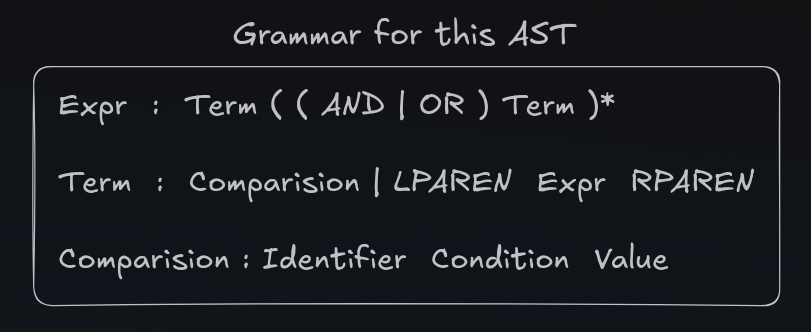
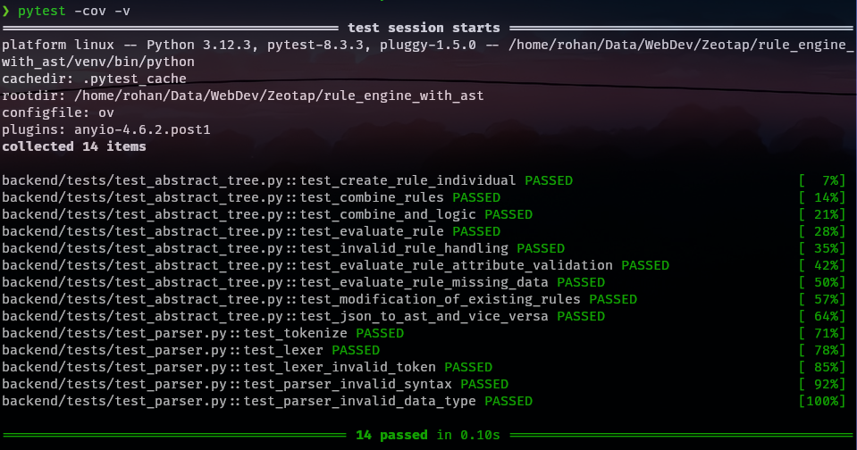
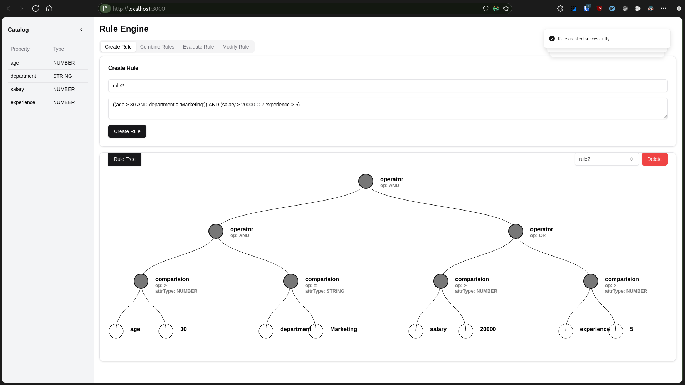
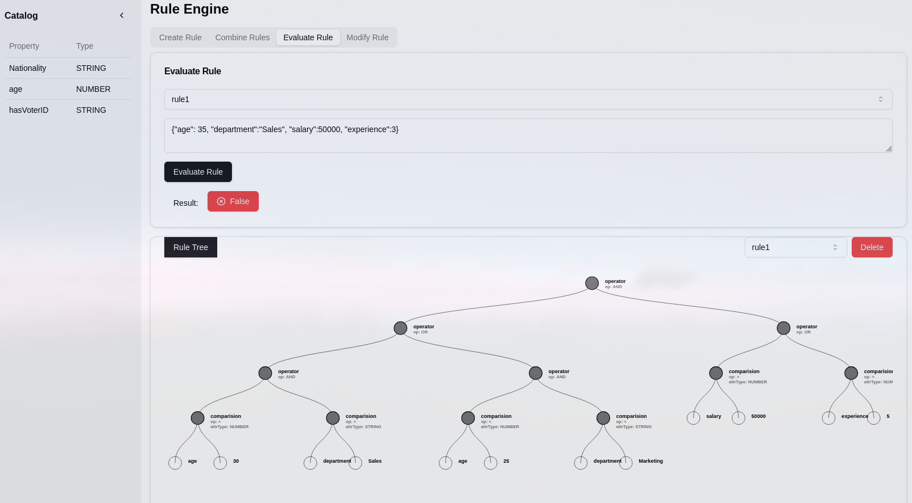

# Rule Engine with Abstract Syntax Tree (AST)

> Zeotap | software Engineer Intern | Assignment | Application 1

## Applicant Introduction

Hi, I'm Rohan Jaiswal, a problem-solver and Full-Stack Developer skilled in React, Next.js and DSA.

[LinkedIn](https://www.linkedin.com/in/deadrohan19/) | [LeetCode](https://leetcode.com/u/Deadrohan19/) | [Codeforces](https://codeforces.com/profile/deadrohan19)


## Project Overview

This project implements a 3-tier rule engine application that determines user eligibility based on attributes like age, department, income, and spend. The system uses an Abstract Syntax Tree (AST) to represent conditional rules and allows for dynamic creation, combination, and modification of these rules.

## Table of Contents

1. [Features](#features)
2. [System Architecture](#system-architecture)
3. [Getting Started](#getting-started)
   - [Prerequisites](#prerequisites)
   - [Installation](#installation)
4. [Usage](#usage)
   - [Running the Server](#running-the-server)
   - [Running the Frontend](#running-the-frontend)
   - [API Endpoints](#api-endpoints)
5. [Design Choices](#design-choices)
6. [Testing](#testing)
7. [Dependencies](#dependencies)
8. [Frontend Components](#frontend-components)
9. [Docker Setup](#docker-setup)

## Features

-  **Simple and Clean UI**
- Represent rules using **Abstract Syntax Trees (AST)**
- tokens -> lexical analyzer -> parser -> evaluater (interpreter)
- Create, combine, modify, evaluate, and delete complex rules
- Comprehensive **error handling** and **input validation**
- **Catalog** is implemented for type validation and user ease
- RESTful API for rule management and evaluation

## System Architecture

The application follows a 3-tier architecture:

1. **Frontend**: A React-based user interface
2. **Backend API**: FastAPI-based RESTful API for rule management
3. **Database**: PostgreSQL for persistent storage of rules


## Getting Started

### Prerequisites

- Python 3.8+
- Node.js 14+
- PostgreSQL
- Docker

### Installation

1. Clone the repository:
```
git clone https://github.com/deadrohan19/rule_engine_with_ast.git
cd rule_engine_ast_with_ast
```

2. Set up a virtual environment for the backend:
```
python -m venv venv
source venv/bin/activate  # On Windows, use `venv\Scripts\activate`

```

3. Install dependencies

   If `poetry` isn't previously installed, install it first.

   ```bash
   python3 -m venv $VENV_PATH
   $VENV_PATH/bin/pip install -U pip setuptools
   $VENV_PATH/bin/pip install poetry
   ```

   Then continue to create a venv, and install dependencies

   ```bash
   cd backend/
   poetry install
   ```


4. Set up environment variables:
   Create a `.env` file in the project root with the following content:
```
DB_USER=your_db_user
DB_PASSWORD=your_db_password
DB_HOST=localhost
DB_PORT=5432
DB_NAME=rule_engine_db
```

5. Setup postgres in docker ([Docker Setup](#docker-setup))
5. Initialize the database:
```
python -m rule_engine.models
```

7. Install frontend dependencies:

```
cd frontend
npm install
```

## Usage

### Running the Server

To start the FastAPI development server:

```
python main.py --dev
```

By default, the server runs on `http://0.0.0.0:5000`. You can specify a different host and port using the `--host` and `--port` arguments.

### Running the Frontend

To start the React development server:

```
cd frontend
npm run dev
```

The frontend will be available at `http://localhost:3000`.

### API Endpoints

- `POST /create_rule`: Create a new rule
- `POST /evaluate_rule`: Evaluate a rule against provided data
- `POST /combine_rules`: Combine multiple rules
- `GET /get_catalog`: Retrieve the attribute catalog
- `GET /get_rule`: Retrieve a specific rule
- `GET /get_all_rule_names`: Retrieve all rule names
- `DELETE /delete_rule`: Delete a specific rule

For detailed API documentation, run the server and visit `http://localhost:5000/docs`.

## Design Choices

1. **Abstract Syntax Tree (AST)**: ASTs used to represent rules, allowing for efficient evaluation and easy modification of complex rule structures.

2. **FastAPI Framework**: Chosen for its high performance, automatic API documentation, and type checking capabilities.

3. **PostgreSQL**: Used for persistent storage of rules, offering reliability and support for complex queries.

4. **Pydantic Models**: Employed for request/response validation and serialization.

5. **SQLAlchemy ORM**: Provides a high-level abstraction for database operations, making it easier to work with different database systems.

6. **Error Handling**: Custom exception classes for different types of errors (SyntaxError, InvalidTokenError, TypeError, InsufficientDataError) to provide clear and specific error messages.

7. **Modular Structure**: The project is organized into separate modules (parser, abstract_tree, models, etc.) for better maintainability and separation of concerns.

8. **React Frontend**: Utilizes React for a dynamic and responsive user interface, with components for rule creation, visualization, and management.

## String to AST


1. Convert to **tokens**
2. **Lexer** would give tokens a type
3. On the basis of the token types, according to above grammar **Parser** would create AST
4. If syntax is not matching to **grammar**, which implies that **syntax** of received rule is invalid
5. At last, We can use **AST** to evaluate for any data, it is true or not.
6. As the rule is in tree form, then we can **easily modify** it in any way, by counting the number of **left and rights** taken to reach modification juncture.

## Testing

To run the test suite:

```
python main.py --tests
```



This will execute all unit tests using pytest.

## Dependencies

Backend:
- FastAPI: Web framework for building APIs
- Uvicorn: ASGI server for running FastAPI
- SQLAlchemy: SQL toolkit and ORM
- Pydantic: Data validation and settings management
- Psycopg2: PostgreSQL adapter for Python
- Python-dotenv: Loading environment variables from .env files
- Pytest: Testing framework

Frontend:
- React: JavaScript library for building user interfaces
- Next.js: React framework for production-grade applications
- Axios: Promise-based HTTP client for making API requests
- React-d3-tree: Library for rendering tree diagrams
- Tailwind CSS: Utility-first CSS framework

For a complete list of dependencies with version numbers, refer to the `pyproject.toml` file for the backend and `package.json` for the frontend.

## Frontend Components

The frontend consists of three main components:

1. `page.tsx`: The main page component that renders the rule engine interface. It includes tabs for creating, combining, and evaluating rules, as well as displaying the rule tree.

2. `route.ts`: Contains API route definitions and functions for making requests to the backend server.

3. `rule-tree.tsx`: A component for rendering the Abstract Syntax Tree visualization of rules using react-d3-tree.

These components work together to provide a user-friendly interface for managing and visualizing rules in the rule engine.

create rule
--


evaluate rule
--



## Docker Setup

To run the PostgreSQL database in a Docker container:

1. Make sure Docker is installed on your system.

2. Pull the PostgreSQL image:
```
docker pull postgres
```

3. Run the PostgreSQL container:
```
docker run --name rule-engine-db -e POSTGRES_PASSWORD=your_password -e POSTGRES_DB=rule_engine_db -p 5432:5432 -d postgres
```

4. Update the `.env` file with the appropriate Docker container details:
```
DB_USER=postgres
DB_PASSWORD=your_password
DB_HOST=localhost
DB_PORT=5432
DB_NAME=rule_engine_db
```

This setup allows you to run the PostgreSQL database in a containerized environment, providing isolation and easy setup across different development environments.

## References

- [Let's Build a Simple Interpreter by Ruslan Spivak ](https://ruslanspivak.com/lsbasi-part1/)

- [React-d3-tree](https://bkrem.github.io/react-d3-tree/)

- [Shadcn/ui](https://ui.shadcn.com/docs)

## To Be Implemented

- Auto extend the input area when content exceed current viewport
- In evaluate method UI, 
   > Add option to directly add - {attributes}: {value} like in table form
- Extend to add more datatypes

---

This README provides a comprehensive guide to setting up, running, and understanding the Rule Engine project, including both backend and frontend components. For any additional questions or issues, please open an issue in the GitHub repository.
